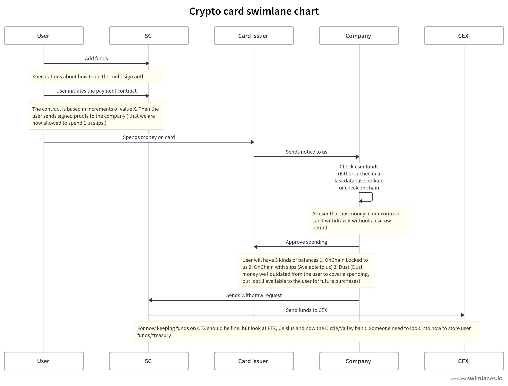
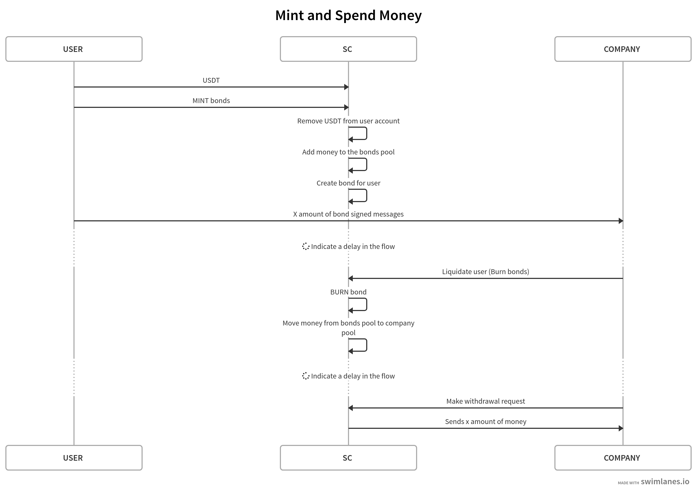

# Objective

I am aiming to develop a platform that allows individuals to transact with their crypto assets seamlessly without converting to fiat currency. My main target audience seems to be DeX users, as they tend to be wary of centralized exchanges (CeX).

### Main Features:
- **Card Issuance**: This will help me facilitate transactions.
- **Smart Contract Integration**: To manage functionalities like deposit, withdrawal, and minting NFTs.
- **Security Measures**: I need to make sure users' funds and personal details are protected.

## Diagrams

A more detailed sequence diagram of the mint and spend process.

# Business Models

## B2B:
I need to clarify how I plan to generate revenue from this platform.

## B2C:
- I am aware that compliance and KYC are going to be major challenges.
- I am concerned about relying on a single API.
- My vision is for this platform to act as a non-custodial 'bank' for crypto assets.

# Unique Selling Points (USPs)
- I'm enabling smooth transactions with crypto assets.
- I'm offering a more secure alternative to traditional banks, especially when considering the vulnerabilities like the "money multiplier effect".
- I am stepping into the future of finance, giving users an option to bypass traditional banking systems.

# Technical Aspects
- **Smart Contract**: This will handle operations like user deposits, withdrawals, and NFT activities.
- **Security**: I'll incorporate zk proofs, password systems, and nonce for added security layers.
- **Minting NFTs (or "Slips")**: My idea is for each NFT to represent a specific amount of money, acting as a claim for that sum.

# Challenges
- I need to figure out the KYC process and how to be compliant.
- A big challenge will be to find a suitable card issuer.
- I need to decide on how much to keep in the treasury.
- I'll have to deal with the complexities of tokenomics.
- Given the nature of my platform, there's a risk of it being 'canceled' or not accepted widely.

# Implementation

## Immediate Steps:
- My initial plan is to develop a smart contract.
- I want to simulate how card issuance would work.
- I need to put together an internal ledger system.
- I'm looking to create a prototype app using Flutter.

## Long-term Goals:
- I aim to list my tokens on CEX.
- My goal is to integrate with a card issuer.
- Fundraising will be necessary for treasury and card integration.

# Miscellaneous
- I must think about the potential risks tied to the money multiplier effect.
- There's also the possibility of causing bank runs, and I need to think about what that means.
- I'm brainstorming names and slogans for my project.
- I've noted down security details and phrases for MetaMask.

# Potential Collaborations
I'm exploring partnerships with platforms like Zengo and Enfuce, among others.
